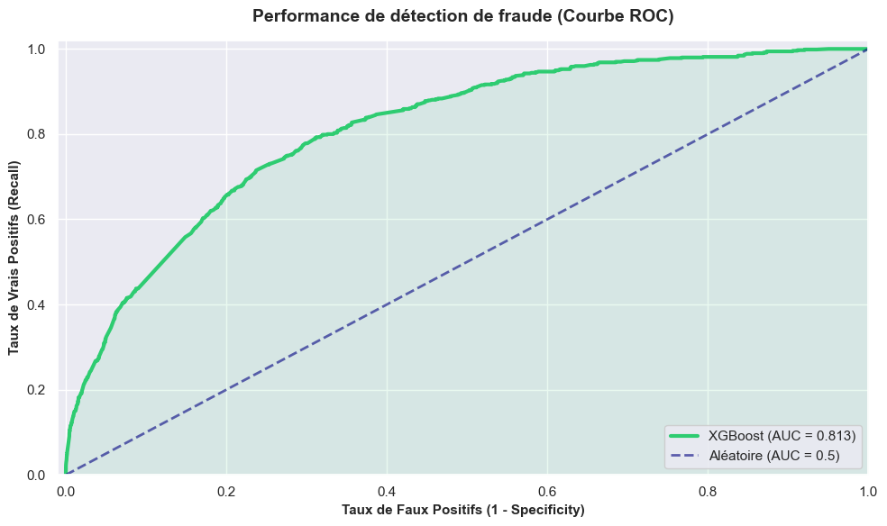
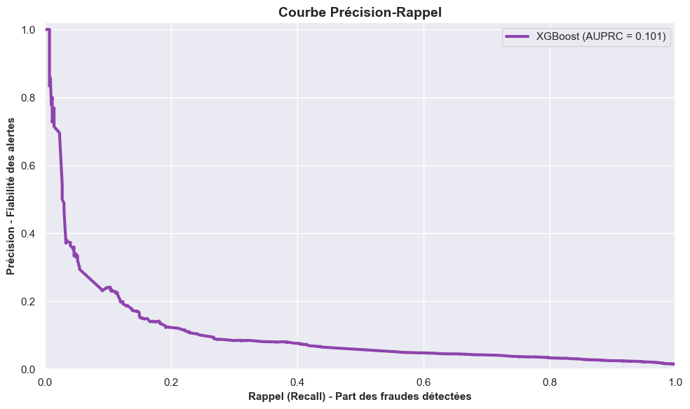

# Détection de fraude - BNP Paribas Personal Finance

Ce dépôt contient le code et l'analyse réalisés dans le cadre du [Challenge Data ENS](https://challengedata.ens.fr) proposé 
par BNP Paribas Personal Finance. 

Ce projet a été mené au cours de mon master Mathématiques et Applications (spécialité Ingénierie Statistique, Actuariat et 
Data Science) à l'Université Paris-Saclay. Il vise à mettre en pratique des méthodes avancées de machine learning sur des données 
transactionnelles réelles.

## Objectif du projet

Le but de ce challenge est de démasquer les fraudeurs. Il s'agit d'un problème d'apprentissage supervisé (classification 
binaire) où l'objectif est d'identifier si une opération est frauduleuse en se basant sur le contenu d'un panier d'achat. 

Les données fournies contiennent des informations détaillées sur les articles achetés (prix, marques, modèles, etc.) pouvant aller 
jusqu'à 24 articles par transaction.

## Structure du projet

* `notebooks/Projet - BNP Paribas PF.ipynb` : Le notebook principal contenant l'exploration des données (EDA),
le preprocessing (gestion des valeurs manquantes, encodage), et l'entraînement des modèles de classification.
* `data/` : Dossier prévu pour héberger les fichiers d'entraînement et de test (`X_test.csv`, `Y_train.csv`, etc.).  
*Note : Les données ne sont pas hébergées sur ce dépôt pour des raisons de taille. Elles sont disponibles sur le site du Challenge Data ENS.*

## Technologies et Modèles utilisés

L'analyse et la modélisation ont été réalisées en **Python**.
* **Manipulation de données :** `pandas`, `numpy`
* **Visualisation :** `matplotlib`, `seaborn`
* **Machine Learning :** `scikit-learn`, `xgboost`, `lazypredict`
* **Techniques clés :**
    * Restructuration de données complexes (transformation Wide to Long).
    * Imputation des données manquantes.
    * Réduction de dimension (PCA).
    * Évaluation des performances via la métrique **PR-AUC** (Area Under the Precision-Recall Curve), particulièrement adaptée
      aux jeux de données très déséquilibrés comme la détection de fraude.

## Performances du modèle

Le modèle final basé sur **XGBoost** a été évalué sur un jeu de test indépendant. Étant donné le fort déséquilibre des classes (moins de 2% de fraude), l'accent a été mis sur la courbe Précision-Rappel.

| Courbe ROC (AUC = 0.81) | Courbe Précision-Rappel (PR-AUC) |
|:---:|:---:|
|  |  |

*Note : La courbe PR montre que le modèle conserve une précision exploitable même pour des niveaux de rappel élevés, ce qui est crucial pour limiter le nombre de faux positifs en production.*

## Comment reproduire l'analyse

Clonez ce repository :
   ```bash
   git clone https://github.com/jean-guillaum3/bnp-paribas-fraud-detection.git
   cd bnp-paribas-fraud-detection
